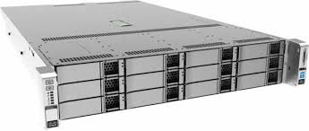

#  Proxmox Home Lab Build

A how to guide to plan and track a Proxmox home lab build. This guide was initially written for Proxmox 6.2 but will be kept up to date as necessary.

# The Goals
These are my goals for this project.

- **Easy to build & maintain,** *in case I need to rebuild it from scratch*
- **Modular,** *I prefer to put things in a Container or VM rather then the base config*
- **Secure,** *Security built in*
- **Single host (no HA),** *this is a home lab build not Enterprise Production, I can afford some downtime and don't need High Availability*
- **Redundant Storage,** *In case of drive failure*
- **Offsite/Offhost Backups,** *In case of complete host failure*
- **Monitoring & Alerts,** *to know whats going on*
- **Automated,** *Automate the world*


# The Plan

<!-- TOC -->

1. [x] [1. Initial Install](#initialinstall)
2. [ ] [2. Base Config](#baseconfig)
3. [ ] [3. Setting up Networking](#networking)
4. [ ] [4. Building ZFS Storage](#zfs)
5. [ ] [5. Securing Proxmox](#security)
6. [ ] [6. Deploying the first VM :: PFSense](#pfsense)
7. [ ] [7. Deploying the first Container :: NAS](#nas)
8. [ ] [8. To Do](#todo)

<!-- /TOC -->

# Let's go . . .

## 1. Initial Install <a name="initialinstall"></a>

### 1.1 Hardware
###### 1.1.1 [Proxmox Official System Requirements][728bcac8]

  [728bcac8]: https://www.proxmox.com/en/proxmox-ve/requirements "Proxmox Official System Requirements"

  > ### Recommended Hardware
  >  - Intel EMT64 or AMD64 with Intel VT/AMD-V CPU flag.
  >  - Memory, minimum 2 GB for OS and Proxmox VE services. Plus designated memory for guests. For Ceph or ZFS additional memory is required, approximately 1 GB memory for every TB used storage.
  >  - Fast and redundant storage, best results with SSD disks.
  >  - OS storage: Hardware RAID with batteries protected write cache (“BBU”) or non-RAID with ZFS and SSD cache.
  >  - VM storage: For local storage use a hardware RAID with battery backed write cache (BBU) or non-RAID for ZFS. Neither ZFS nor Ceph are compatible with a hardware RAID controller. Shared and distributed storage is also possible.
  >  - Redundant Gbit NICs, additional NICs depending on the preferred storage technology and cluster setup – 10 Gbit and higher is also supported.
  >  - For PCI(e) passthrough a CPU with VT-d/AMD-d CPU flag is needed.

In addition to the official system requirements we have to take into account our use of ZFS as a file storage system so this should be noted as well.


###### 1.1.2 [ZFS on Linux Hardware Recommendations][3b4c6a09]

  [3b4c6a09]: https://pve.proxmox.com/wiki/ZFS_on_Linux#_hardware "ZFS on Linux Hardware Recommendations"

  >  ZFS depends heavily on memory, so you need at least 8GB to start. In practice, use as much you can get for your hardware/budget. To prevent data corruption, we recommend the use of high quality ECC RAM.

  >  If you use a dedicated cache and/or log disk, you should use an enterprise class SSD (e.g. Intel SSD DC S3700 Series). This can increase the overall performance significantly.

  >  Important	Do not use ZFS on top of hardware controller which has its own cache management. ZFS needs to directly communicate with disks. An HBA adapter is the way to go, or something like LSI controller flashed in “IT” mode.

  >  If you are experimenting with an installation of Proxmox VE inside a VM (Nested Virtualization), don’t use virtio for disks of that VM, since they are not supported by ZFS. Use IDE or SCSI instead (works also with virtio SCSI controller type).

###### 1.1.3 Boot drive

A word on choosing an appropriate boot drive. While ESXI suggests using a USB key or SD Card to boot its minimal OS that is primarly because it loads the OS in memory after the initial boot and limits all writes to the boot drive after its loaded. FreeNAS as well, has been optimized to run on USB keys and limits writes to the boot drive. Proxmox, on the other hand, is based on Debian and has not optimized the OS for use in USB keys as a boot drive.

So you have a choice . . .

  1. Install Proxmox to a storage medium that is optimized for lots of writes. Example Harddrive, high endurance SSD/USB key.
  2. If installing to standard USB key make sure you have a mirrored boot drive so that when your boot drive fails (and it will) you have a backup ready to take over.
  3. Both 1 & 2

My choice in this regard is #3 because I have lots of harddrives in my server and I can use two in a mirrored vdev ZFS RAID1 Pool.



###### 1.1.4 The Hardware  

|| Hardware |
|---|---|
|Server | Cisco C240 M4L |
|CPU | 2 x E5-2620 v3 (12 cores / 24 Threads)  |
|RAM   |  64GB ECC |
|Boot Drive  | 2 x 2TB  |
|Data Drive | 10 x 2TB  |
| HBA  | CISCO UCSC-MRAID12G  |
| Network  | 2 x 10GE, 2 x 1GE + IPMI|
| GPU | None  |

A note on the RAID card. I have set the drives to JBOD, disabled all caching & turned off the cards BIOS in its settings so its operating in HBA mode. Need to test whether or not the Host OS can see the drives directly without a cache in between as this, generally speaking, isn't a recommended card for ZFS. However, if I try to put in any 3rd party card that the bios doesn't recognize (re: non Cisco) the server will override the fan policy & turn the fans on full blast which converts my Home Lab Build into a Cessna on takeoff.


### 1.2 Installation

I'm not going to re-write the installation process here as the official documentation is good in this regard and if not there are lots of resources on the web to help. Its pretty easy however and can be summed up by . . .

1. Download the ISO, https://www.proxmox.com/en/downloads/category/iso-images-pve
2. Write the ISO to a bootable USB flash drive using a tool like [Etcher][f77bac93]
3. Insert the USB key into your server and follow the prompts

[f77bac93]: https://etcher.io/ "Etcher"

_Although in my case I use the KVM on the IPMI port of my server to load the ISO to a virtual drive and boot the server off of that :D_

[Prepare Installation Media][be7d23ee]

  [be7d23ee]: https://pve.proxmox.com/pve-docs/pve-admin-guide.html#installation_prepare_media "Prepare Installation Media"

[Using the Proxmox VE Installer][9dc28777]

  [9dc28777]: https://pve.proxmox.com/pve-docs/pve-admin-guide.html#installation_installer "Using the Proxmox VE Installer"

Some Notes:

- Choose, `Install Proxmox VE` :)
- Because I am installing a ZFS root using a Mirrored or RAID1 setup I'll click `Options`, select `zfs (RAID1)` as my filesystem & pick my two boot drives.
- I leave the `advanced options` at the default.

_I know I am wasting a ton of space by not partitioning my boot disk into separate partitions for the Host, VM's, Containers & data but my goal is to keep things simple. So if I need to perform a complete rebuild or transfer my system to another host I can easily reinstall Proxmox on a new drive, resetup the base config/networking, connect my data drives, import my pools, VM's & containers and I'm pretty much back up and running from a boot drive failure._

- the rest is pretty straight forward

## 2. Base Config <a name="baseconfig"></a>

Great, you still with me :) This is where the fun part starts.

### 2.1 Confirm remote connectivity

###### 2.1.1 Log in via https and ssh  
https://<server_ip>:8006

AND

ssh root@<server_ip>

type in credentials:
  - Username: root
  - Password: <the_password_you_choose_during_install>

###### 2.1.2a You were able to successfully logged in  
Assuming you were able to log in then you should be good at this point to disconnect the monitor, keyboard and mouse from the server and complete the rest of the steps remotely.

###### 2.1.2b You were NOT able to successfully logged in  
If you weren't able to connect you need to figure out why, I would suggest to try pinging the <server_ip> and if it responds the problem may be the username/password. If it doesn't respond then issue is most likely network related, start by tracing the physical cable and check your network config after that.

Some useful links:

https://pve.proxmox.com/pve-docs/pve-admin-guide.html#sysadmin_network_configuration

https://unix.stackexchange.com/questions/128439/good-detailed-explanation-of-etc-network-interfaces-syntax

https://ubuntu.com/blog/if-youre-still-using-ifconfig-youre-living-in-the-past

Some useful commands:

`systemctl status networking`  
`systemctl restart networking`  
`ip address show`  
`ip link show`  

to make changes to the network Config . . .

`nano /etc/network/interfaces` _update config, save the file, then_  
`systemctl restart networking` _&_  
`ip address show` _to check if the changes had an effect & **check remote connectivity again**_  


### 2.2 Update Package respositories and perform an initial update

Because this is a Home Lab and not enterprise you need to update the package repos to reflect this.

###### 2.2.1 Add the no subscription repo to the sources list  
`nano /etc/apt/sources.list`

Add the no subscription repo . . .

> \# PVE pve-no-subscription repository provided by proxmox.com,
> \# NOT recommended for production use
> deb http://download.proxmox.com/debian/pve buster pve-no-subscription

###### 2.2.2 Remove the enterprise subscription
`nano /etc/apt/sources.list.d/pve-enterprise.list`

comment out the line in that file like this otherwise any apt-get update will fail because you don't have access to that repo . . .

> \#deb https://enterprise.proxmox.com/debian/pve buster pve-enterprise  

###### 2.2.3 Test updating via the Gui and cli  
You should now be able to update either via the gui or command line

`apt-get update && apt-get dist-upgrade -y`  

Perform a reboot...'just in case'  
**reboot**

reference : https://pve.proxmox.com/pve-docs/pve-admin-guide.html#_system_software_updates

### 2.3 Update NTP

###### 2.3.1 Add your time servers
`nano /etc/systemd/timesyncd.conf`  

_uncomment all of the lines and update the first line to look like this but pick your own time servers to sync too_

>[Time]  
NTP=time.nrc.ca time.chu.nrc.ca ntp.torix.ca  

###### 2.3.2 Restart the synchronization service  
`systemctl restart systemd-timesyncd`  

###### 2.3.3 Verify that your newly configured NTP servers are used by checking the journal  
`journalctl --since -1h -u systemd-timesyncd`  

reference:: https://pve.proxmox.com/pve-docs/pve-admin-guide.html#_time_synchronization  

### 2.4 Get Postfix to Send Notifications (Email) Externally

###### 2.4.1 Install libsasl2-modules  
`apt install libsasl2-modules`  

###### 2.4.2 Backup your current postfix configuration  
`cp /etc/postfix/main.cf /etc/postfix/main.cf.bak`  

###### 2.4.3 Modify your postfix configuration as follows:
`nano /etc/postfix/main.cf`  
###### Modify the line:  
`relayhost = [smtp.gmail.com]:587`  
###### Add the following lines to the end:  
```
smtp_sender_dependent_authentication = yes

sender_dependent_relayhost_maps = hash:/etc/postfix/sender_relayhost.hash
smtp_sasl_auth_enable = yes

smtp_sasl_password_maps = hash:/etc/postfix/sasl_auth.hash

smtp_sasl_security_options = noanonymous

smtp_use_tls = yes

smtp_tls_CAfile = /etc/ssl/certs/ca-certificates.crt  
```

###### 2.4.4 Create your authorization hash file:  
>NOTE: if you have MFA configured you'll need to create an App password for your Gmail account and add that below as yourpassword  
https://support.google.com/accounts/answer/185833?hl=en

`echo [smtp.gmail.com]:587 your_username@gmail.com:yourpassword > /etc/postfix/sasl_auth.hash`  

###### 2.4.5 Create your sender_relayhost file (this makes sure that you always use your gmail as the sender:  
`echo your_username@gmail.com [smtp.gmail.com]:587 > /etc/postfix/sender_relayhost.hash`  

###### 2.4.6 Now postmap the files:  
`postmap /etc/postfix/sender_relayhost.hash`  
`postmap /etc/postfix/sasl_auth.hash`  

###### 2.4.7 Make sure to make your password only readable by root:  
`chmod 400 /etc/postfix/sasl_auth.*` 

###### 2.4.8 Restart Postfix:  
`postfix reload` OR `systemctl restart postfix.service`  

###### 2.4.9 Test:  
**Test from Postfix:**  
`systemctl status postfix.service`  
`echo "Test mail from postfix" | mail -s "Test Postfix" test@test.com`  

**Test from PVE:**  
`echo "test" | /usr/bin/pvemailforward`  

###### 2.4.10 Logs:  
`/var/log/mail.warn`  
`/var/log/mail.info`  

References:  
https://github.com/ShoGinn/homelab/wiki/Proxmox-PostFix---Email  
https://forum.proxmox.com/threads/get-postfix-to-send-notifications-email-externally.59940/

### 2.5  Setup notifications to a Slack channel using a webhook

###### 2.5.1 Setup a new incoming webhook in Slack by adding this app to a channel  
https://slack.com/apps/A0F7XDUAZ-incoming-webhooks  
Configure it how you want but copy down the web hook url for later, it will look something like this . . . 
`https://hooks.slack.com/services/d8a9das90d8/ds79d07asd0a/dff9sdf89dfdpivcs` **this is faked**  

###### 2.5.2  Install some required apps and modules for perl

`apt-get install dh-make-perl`  
`cpan Slack::WebHook`  

###### 2.5.3 Create a perl script which we will use to forward emails to the slack channel

`nano /usr/local/sbin/post2slack.pl`  

Add the following lines to the file . . .  

> \#!/usr/bin/perl -T  
>  
> \# https://metacpan.org/pod/Slack::WebHook  
> 
> use strict;  
> use warnings;  
> use Slack::WebHook;  
> 
> $ENV{'PATH'} = '/sbin:/bin:/usr/sbin:/usr/bin';  
> 
> my $hook = Slack::WebHook->new( 
               url => 'https://hooks.slack.com/services/fdsafdsfdsfds/ffdsasdfsdfsdf'  
> );  
>  
>  my $stdin_h = do { local $/; <STDIN> };  
>  
>  $hook->post_ok( $stdin_h );  

###### 2.5.4 Make the script executable  

`chmod 755 /usr/local/sbin/post2slack.pl`  

###### 2.5.5 Add the script to root's forwards files

`echo "|/usr/local/sbin/post2slack.pl" >> /root/.forward`  

###### 2.5.6 Test by sending a message to root  

`echo "Test mail from postfix sent to slack" | mail -s "Test Slack" root`  

###### 2.5.7 Alternatively send emails to a slack channel

If you have a paid slack account you can alternatively setup a email address that slack will monitor for incoming emails and post it to a slack channel  

This is the slack app you need to setup  
https://slack.com/apps/A0F81496D-email  

Add the slack email to the bottom of root's .forwards file  
`echo "foobar@example.com" >> /root/.forward`  

And test  
`echo "Test mail from postfix sent to slack" | mail -s "Test Slack" root`  

References:  
https://api.slack.com/messaging/webhooks  
https://metacpan.org/pod/Slack::WebHook  
https://forum.proxmox.com/threads/proxmox-alert-emails-can-you-automatically-cc-people.53332/  

###### 2.6

## 3. Setting up Networking <a name="networking"></a>

## 4. Building ZFS Storage <a name="zfs"></a>

## 5. Securing Proxmox <a name="security"></a>

## 6. Deploying the first VM :: PFSense <a name="pfsense"></a>

## 7. Deploying the first Container :: NAS <a name="nas"></a>

## 8. To Do <a name="todo"></a>

??? https://wiki.debian.org/UnattendedUpgrades ???
